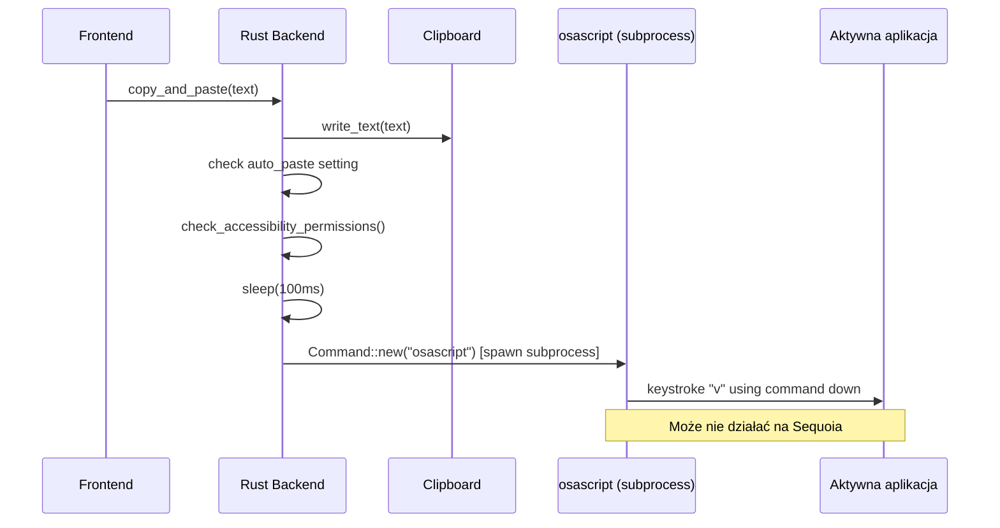
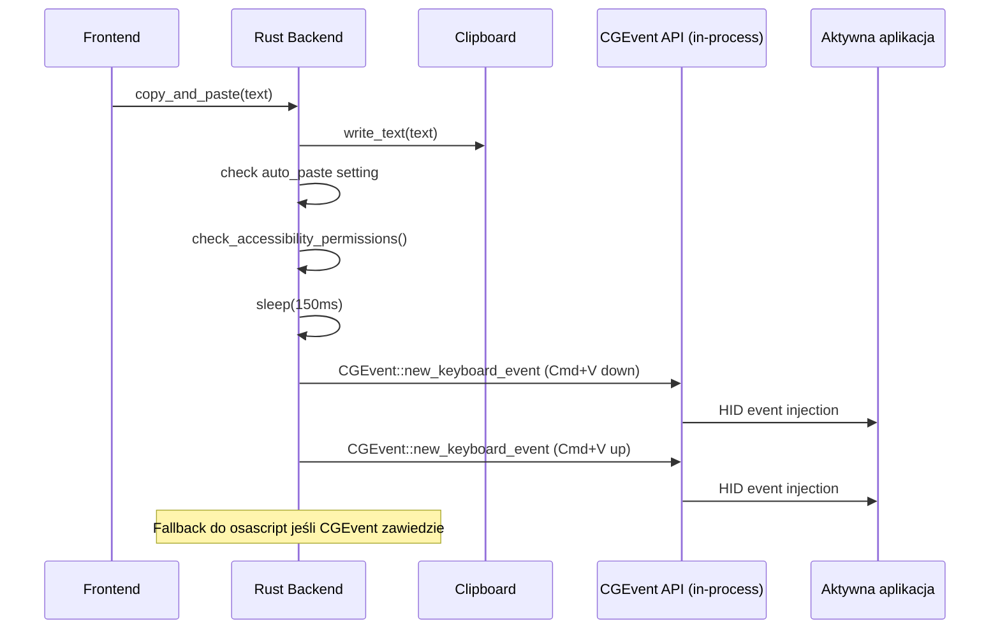

# Design Document: Fix Auto-Paste on macOS

## Overview

Obecna implementacja auto-paste na macOS używa `osascript` do uruchomienia AppleScript (`tell application "System Events" to keystroke "v" using command down`). To podejście jest niewydajne (spawn subprocesu), podatne na problemy z uprawnieniami na macOS Sequoia/Sonoma i nie zapewnia dobrej diagnostyki błędów.

Rozwiązanie polega na zastąpieniu AppleScript natywnym API `CGEvent` z crate'u `core-graphics`, które bezpośrednio wstrzykuje zdarzenia klawiatury na poziomie systemu operacyjnego. Dodatkowo, dodamy lepsze logowanie i komunikaty o błędach dla użytkownika.

## Architecture

### Obecny flow (do zmiany)



### Nowy flow (CGEvent)



## Components and Interfaces

### 1. `perform_paste()` — macOS implementation (lib.rs)

Główna zmiana — zastąpienie `osascript` bezpośrednim wywołaniem `CGEvent`:

```rust
#[cfg(target_os = "macos")]
fn perform_paste() -> Result<(), String> {
    use core_graphics::event::{CGEvent, CGEventFlags, CGEventTapLocation};
    use core_graphics::event_source::{CGEventSource, CGEventSourceStateID};

    // macOS virtual keycode for 'V' = 9 (kVK_ANSI_V)
    const KEYCODE_V: u16 = 9;

    let source = CGEventSource::new(CGEventSourceStateID::HIDSystemState)
        .map_err(|_| "Failed to create CGEventSource".to_string())?;

    let key_down = CGEvent::new_keyboard_event(source.clone(), KEYCODE_V, true)
        .map_err(|_| "Failed to create key-down event".to_string())?;
    let key_up = CGEvent::new_keyboard_event(source, KEYCODE_V, false)
        .map_err(|_| "Failed to create key-up event".to_string())?;

    key_down.set_flags(CGEventFlags::CGEventFlagCommand);
    key_up.set_flags(CGEventFlags::CGEventFlagCommand);

    key_down.post(CGEventTapLocation::HID);
    key_up.post(CGEventTapLocation::HID);

    Ok(())
}
```

Kluczowe decyzje:
- `CGEventSourceStateID::HIDSystemState` — symuluje zdarzenia z poziomu systemu HID, tak jakby przychodziły z fizycznej klawiatury
- `CGEventTapLocation::HID` — wstrzykuje na najniższym poziomie, trafia do aktualnie aktywnej aplikacji
- `CGEventFlags::CGEventFlagCommand` — ustawione na obu eventach (down + up), nie wymaga osobnego press/release modifiera

### 2. `perform_paste_fallback()` — AppleScript fallback (lib.rs)

Obecna implementacja osascript zostanie zachowana jako fallback:

```rust
#[cfg(target_os = "macos")]
fn perform_paste_fallback() -> Result<(), String> {
    use std::process::Command;

    let output = Command::new("osascript")
        .args(["-e", r#"tell application "System Events" to keystroke "v" using command down"#])
        .output()
        .map_err(|e| format!("Failed to run osascript: {}", e))?;

    if output.status.success() {
        Ok(())
    } else {
        let stderr = String::from_utf8_lossy(&output.stderr);
        Err(format!("AppleScript paste failed: {}", stderr))
    }
}
```

### 3. Zaktualizowany `copy_and_paste()` — flow z fallback (lib.rs)

Zmiana w delay (100ms → 150ms) oraz dodanie fallback:

```rust
// Small delay to let clipboard propagate
tokio::time::sleep(std::time::Duration::from_millis(150)).await;

let paste_result = tokio::task::spawn_blocking(|| {
    // Try CGEvent first, fallback to AppleScript
    match perform_paste() {
        Ok(()) => Ok(()),
        Err(e) => {
            println!("[Dictato] CGEvent paste failed: {}. Trying AppleScript fallback...", e);
            perform_paste_fallback()
        }
    }
}).await;
```

### 4. Dependency: `core-graphics` (Cargo.toml)

Dodanie jako macOS-only dependency:

```toml
[target.'cfg(target_os = "macos")'.dependencies]
core-graphics = "0.25"
```

## Data Models

Brak zmian w modelach danych. Zmiana dotyczy wyłącznie mechanizmu paste (implementacja `perform_paste()`). Ustawienie `autoPaste` w store pozostaje bez zmian.

## Error Handling

### Strategia warstw błędów

```
CGEvent paste
    ├── Sukces → log "[Dictato] Auto-pasted (CGEvent)"
    └── Błąd → log błąd, try fallback
         ├── AppleScript fallback sukces → log "[Dictato] Auto-pasted (AppleScript fallback)"
         └── AppleScript fallback błąd → log błąd, tekst w schowku
              └── Użytkownik widzi: tekst w schowku, może wkleić ręcznie
```

### Scenariusze błędów

| Scenariusz | Zachowanie |
|---|---|
| Brak uprawnień Accessibility | Log + tekst w schowku (obecne zachowanie, bez zmian) |
| CGEvent source creation fail | Fallback do AppleScript |
| CGEvent post fail (permissions reset) | Fallback do AppleScript |
| AppleScript fallback fail | Log + tekst w schowku do ręcznego wklejenia |
| Floating window kradnie fokus | Nie powinno się zdarzyć — `.focused(false)` jest ustawione |

### Logowanie

Wszystkie operacje paste logują wynik do konsoli deweloperskiej z prefixem `[Dictato]`:
- `[Dictato] Auto-pasted (CGEvent)` — sukces główny
- `[Dictato] CGEvent paste failed: {error}. Trying AppleScript fallback...` — fallback
- `[Dictato] Auto-pasted (AppleScript fallback)` — sukces fallback
- `[Dictato] Auto-paste failed: {error}. Text is in clipboard - press Cmd+V to paste.` — oba zawiodły

## Testing Strategy

### Testy manualne (na macOS)

1. Uruchomić Dictato z uprawnieniami Accessibility → nagrać transkrypcję → sprawdzić czy tekst jest automatycznie wklejony w aktywną aplikację (np. TextEdit, VS Code)
2. Odebrać uprawnienia Accessibility → sprawdzić czy użytkownik dostaje komunikat o brakujących uprawnieniach i tekst jest w schowku
3. Sprawdzić logi konsoli deweloperskiej — powinny pokazywać `(CGEvent)` przy sukcesie
4. Przetestować na macOS Sequoia po resecie uprawnień

### Testy jednostkowe

- Test `check_accessibility_permissions()` — mockowanie `AXIsProcessTrusted`
- Test flow `copy_and_paste` — sprawdzenie że clipboard jest zawsze ustawiony przed próbą paste
- Test fallback logic — sprawdzenie że CGEvent failure triggeruje AppleScript fallback

### Testy kompilacji

- Sprawdzić że `core-graphics` jest only na macOS (`cfg(target_os = "macos")`)
- Sprawdzić że build na Linux/Windows nadal kompiluje się bez `core-graphics`
