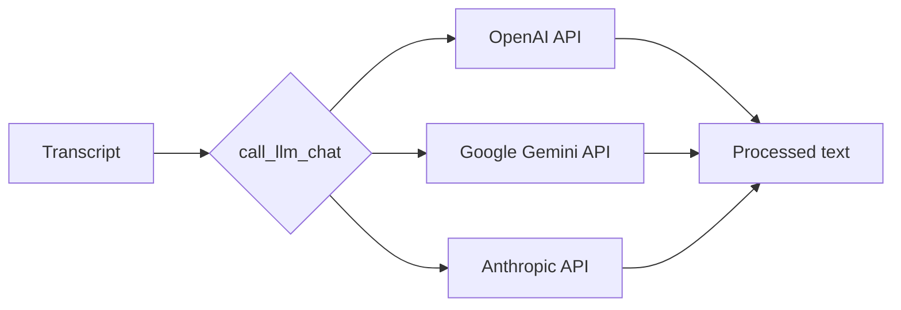
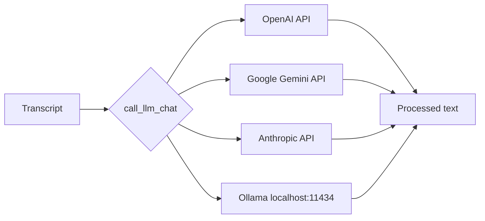
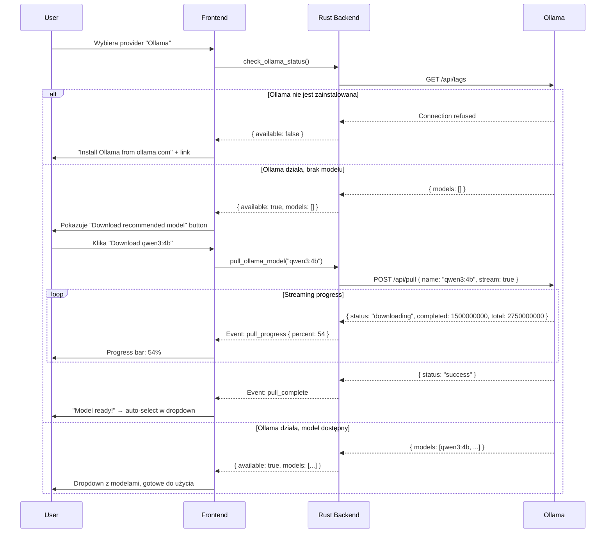
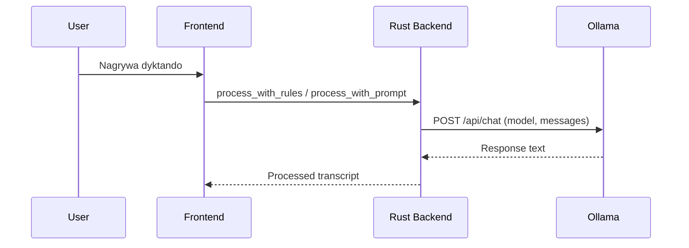

# Design: Lokalny LLM Provider (Ollama)

## Overview

Dodanie nowego providera LLM do Dictato, który umożliwi przetwarzanie tekstu (interpunkcja, formatowanie, reguły) za pomocą lokalnego modelu uruchamianego przez Ollama. Użytkownik nie potrzebuje klucza API ani połączenia z internetem — wystarczy zainstalowane Ollama z pobranym modelem.

### Wyniki researchu

**Czy to ma sens technicznie?** Tak. Zadania realizowane przez LLM w Dictato (poprawa interpunkcji, usuwanie filler words, formatowanie) to proste transformacje tekstu. Modele w rozmiarze 1.7B–4B radzą sobie z nimi dobrze.

**Wsparcie języka polskiego i angielskiego:**
- **Qwen3-4B** (rekomendacja główna) — 119 języków, w tym polski. Q4 quantization = ~2.75 GB RAM. Na Apple Silicon: 40–60 tok/s. Wydajność porównywalna z Qwen2.5-7B przy połowie zasobów.
- **Qwen3-1.7B** (alternatywa lekka) — ~1.5 GB RAM, 60–80 tok/s. Wystarczy do interpunkcji, ale może gubić niuanse polskiego.
- **Bielik-4.5B** (alternatywa polska) — najlepsza jakość polskiego, ale słabszy angielski.
- **Phi-3.5-mini** (3.8B) — 22 języki, w tym polski. 128K kontekst.

**Dlaczego Ollama?**
- HTTP API na `localhost:11434` — trivialnie integrujemy z istniejącym kodem `reqwest` w Rust
- Zarządzanie modelami (pull, lista, usuwanie) out of the box
- MLX jest szybsze (~50%), ale wymaga osobnej integracji Python/C++ — niewarte złożoności dla krótkich tekstów
- Ollama opakowuje llama.cpp, który i tak wykorzystuje Metal na Apple Silicon

**Wydajność na MacBooku:**
- Dla transkrypcji 200 słów (~300 tokenów wyjściowych):
  - Qwen3-4B: ~5–7 sekund (łącznie z prompt processing)
  - Qwen3-1.7B: ~3–5 sekund
- To jest akceptowalne dla flow: nagranie → transkrypcja → przetwarzanie → clipboard

---

## Architecture

### Obecna architektura LLM



### Docelowa architektura



Ollama dołącza jako kolejny wariant `LlmProvider` enum. Nie wymaga API key — zamiast tego potrzebuje nazwy modelu i działającego procesu Ollama.

### Diagram sekwencji — first-time setup (auto-pull)



### Diagram sekwencji — normalne użycie



---

## Components and Interfaces

### 1. Rust: `LlmProvider` enum (zmiana)

```rust
// src-tauri/src/llm.rs
#[derive(Debug, Clone, Serialize, Deserialize, PartialEq, Default)]
#[serde(rename_all = "lowercase")]
pub enum LlmProvider {
    #[default]
    OpenAI,
    Google,
    Anthropic,
    Ollama,  // NOWY
}
```

### 2. Rust: Ollama API client (nowe funkcje w `llm.rs`)

```rust
const OLLAMA_API_URL: &str = "http://localhost:11434";
const OLLAMA_DEFAULT_MODEL: &str = "qwen3:4b";

// Struktury request/response dla Ollama /api/chat
#[derive(Serialize)]
struct OllamaChatMessage {
    role: String,
    content: String,
}

#[derive(Serialize)]
struct OllamaChatRequest {
    model: String,
    messages: Vec<OllamaChatMessage>,
    stream: bool,  // false — czekamy na pełną odpowiedź
    options: OllamaOptions,
}

#[derive(Serialize)]
struct OllamaOptions {
    temperature: f32,
    num_predict: i32,  // max tokens
}

#[derive(Deserialize)]
struct OllamaChatResponse {
    message: OllamaChatMessageResponse,
}

#[derive(Deserialize)]
struct OllamaChatMessageResponse {
    content: String,
}

/// Call local Ollama API
async fn call_ollama_chat(
    model: &str,
    system_prompt: &str,
    user_content: &str,
) -> Result<String, String> { ... }
```

Kluczowa zmiana w `call_llm_chat`:
```rust
pub async fn call_llm_chat(
    provider: &LlmProvider,
    api_key: &str,          // pusty string dla Ollama
    system_prompt: &str,
    user_content: &str,
    ollama_model: Option<&str>,  // NOWY parametr
) -> Result<String, String> {
    match provider {
        LlmProvider::OpenAI => call_openai_chat(api_key, system_prompt, user_content).await,
        LlmProvider::Google => call_google_chat(api_key, system_prompt, user_content).await,
        LlmProvider::Anthropic => call_anthropic_chat(api_key, system_prompt, user_content).await,
        LlmProvider::Ollama => {
            let model = ollama_model.unwrap_or(OLLAMA_DEFAULT_MODEL);
            call_ollama_chat(model, system_prompt, user_content).await
        }
    }
}
```

**Alternatywne podejście (prostsze):** Zamiast dodawać parametr `ollama_model` do `call_llm_chat`, przekazywać nazwę modelu przez `api_key` field (jest nieużywany dla Ollama). To uniknie zmian sygnatury, ale jest semantycznie nieczyste. **Rekomendacja: dodać parametr.**

### 3. Rust: Tauri commands (nowe w `lib.rs`)

```rust
/// Sprawdź czy Ollama jest uruchomiona i zwróć listę modeli
#[tauri::command]
async fn check_ollama_status() -> Result<OllamaStatus, String> {
    // GET http://localhost:11434/api/tags
    // Zwraca: { available: bool, models: Vec<OllamaModelInfo> }
}

/// Walidacja Ollama (zamiast klucza API)
#[tauri::command]
async fn validate_ollama() -> Result<(), String> {
    // Sprawdza czy Ollama odpowiada + czy wybrany model jest dostępny
}

/// Pobierz model z Ollama registry — streamuje postęp przez Tauri events
#[tauri::command]
async fn pull_ollama_model(
    app: tauri::AppHandle,
    model_name: String,
) -> Result<(), String> {
    // POST http://localhost:11434/api/pull { "name": model_name, "stream": true }
    //
    // Ollama streamuje NDJSON (newline-delimited JSON), każda linia to:
    //   { "status": "downloading digestname", "completed": bytes, "total": bytes }
    //   { "status": "verifying sha256 digest" }
    //   { "status": "writing manifest" }
    //   { "status": "success" }
    //
    // Dla każdej linii z "completed"/"total" emitujemy Tauri event:
    //   app.emit("ollama-pull-progress", PullProgress { percent, status })
    //
    // Na zakończenie:
    //   app.emit("ollama-pull-complete", model_name)
    //
    // Na błąd:
    //   app.emit("ollama-pull-error", error_message)
}

/// Usuń pobrany model (opcjonalnie, dla zarządzania dyskiem)
#[tauri::command]
async fn delete_ollama_model(model_name: String) -> Result<(), String> {
    // DELETE http://localhost:11434/api/delete { "name": model_name }
}
```

#### Pull progress event types

```rust
#[derive(Clone, Serialize)]
struct PullProgress {
    percent: u8,        // 0–100
    status: String,     // "downloading", "verifying", "writing manifest"
    completed: u64,     // bytes downloaded
    total: u64,         // total bytes
}
```

### 4. TypeScript: Settings (zmiana w `useSettings.ts`)

Nowe pola w settings:
```typescript
// Dodać do istniejącego typu LlmProvider
type LlmProvider = 'openai' | 'google' | 'anthropic' | 'ollama';

// Nowe ustawienia
interface Settings {
    // ... istniejące pola
    ollama_model: string;          // np. "qwen3:4b"
    ollama_base_url: string;       // domyślnie "http://localhost:11434"
}
```

### 5. Frontend: UI w `GeneralSection.tsx`

Gdy użytkownik wybierze Ollama jako LLM provider, zamiast pola API key wyświetlamy dedykowany panel setup:

#### Stan 1: Ollama nie zainstalowana
```
┌─────────────────────────────────────────────────┐
│  ⚠️  Ollama not detected                        │
│                                                  │
│  Ollama is required to run local AI models.      │
│  Install it from ollama.com — it runs in the     │
│  background automatically after installation.    │
│                                                  │
│  [Download Ollama ↗]          [Retry connection] │
└─────────────────────────────────────────────────┘
```

#### Stan 2: Ollama działa, brak modelu
```
┌─────────────────────────────────────────────────┐
│  ✅  Ollama connected                            │
│                                                  │
│  No models found. Download a recommended model   │
│  to get started:                                 │
│                                                  │
│  ┌─────────────────────────────────────────────┐ │
│  │ Qwen3 4B (Recommended)          2.75 GB    │ │
│  │ 119 languages incl. Polish & English        │ │
│  │ [Download]                                  │ │
│  ├─────────────────────────────────────────────┤ │
│  │ Qwen3 1.7B (Lightweight)        1.5 GB     │ │
│  │ Faster, good for basic punctuation          │ │
│  │ [Download]                                  │ │
│  └─────────────────────────────────────────────┘ │
│                                                  │
│  Or pull any model manually:                     │
│  ollama pull <model-name>     [Refresh models]   │
└─────────────────────────────────────────────────┘
```

#### Stan 3: Pobieranie modelu (progress)
```
┌─────────────────────────────────────────────────┐
│  ⏳  Downloading qwen3:4b...                     │
│                                                  │
│  ████████████████░░░░░░░░░░  54%                 │
│  1.48 GB / 2.75 GB                               │
│                                                  │
│  [Cancel]                                        │
└─────────────────────────────────────────────────┘
```

#### Stan 4: Gotowe do użycia
```
┌─────────────────────────────────────────────────┐
│  ✅  Ollama connected                            │
│                                                  │
│  Model:  [qwen3:4b           ▼]   [Refresh]     │
│                                                  │
│  Status: Ready                                   │
└─────────────────────────────────────────────────┘
```

#### Frontend events (nasłuchiwanie Tauri events)

```typescript
// W komponencie GeneralSection lub dedykowanym OllamaSetup
import { listen } from '@tauri-apps/api/event';

// Nasłuchuj postępu pobierania
const unlisten = await listen<PullProgress>('ollama-pull-progress', (event) => {
    setDownloadPercent(event.payload.percent);
    setDownloadStatus(event.payload.status);
    setDownloadedBytes(event.payload.completed);
    setTotalBytes(event.payload.total);
});

// Nasłuchuj zakończenia
await listen('ollama-pull-complete', () => {
    setDownloadState('complete');
    refreshModels();  // odśwież listę modeli
});

// Nasłuchuj błędu
await listen<string>('ollama-pull-error', (event) => {
    setDownloadState('error');
    setErrorMessage(event.payload);
});
```

### 6. Obsługa `/think` w Qwen3

Qwen3 domyślnie generuje bloki `<think>...</think>` przed odpowiedzią. Dla naszego use case (prosty formatting) chcemy to wyłączyć:
- Dodajemy `/no_think` na końcu system prompt gdy provider = Ollama
- Lub parsujemy odpowiedź i usuwamy blok `<think>` jeśli istnieje

Rekomendacja: **oba** — dodajemy `/no_think` i jako fallback usuwamy bloki `<think>`.

---

## Data Models

### Settings (Tauri Store — `settings.json`)

Nowe klucze:
```json
{
    "llm_provider": "ollama",
    "ollama_model": "qwen3:4b",
    "ollama_base_url": "http://localhost:11434"
}
```

### OllamaStatus (Rust → Frontend)

```rust
#[derive(Serialize)]
struct OllamaStatus {
    available: bool,
    models: Vec<OllamaModelInfo>,
    error: Option<String>,
}

#[derive(Serialize)]
struct OllamaModelInfo {
    name: String,      // np. "qwen3:4b"
    size: u64,         // bajty
    parameter_size: String,  // np. "4B"
}
```

### Ollama API responses

`GET /api/tags` — lista modeli:
```json
{
    "models": [
        {
            "name": "qwen3:4b",
            "size": 2750000000,
            "details": { "parameter_size": "4B", "family": "qwen3" }
        }
    ]
}
```

`POST /api/pull` — pobieranie modelu (streaming NDJSON):
```
Request:
{ "name": "qwen3:4b", "stream": true }

Response (NDJSON — każda linia to osobny JSON):
{"status":"pulling manifest"}
{"status":"downloading sha256:abc123","completed":0,"total":2750000000}
{"status":"downloading sha256:abc123","completed":500000000,"total":2750000000}
{"status":"downloading sha256:abc123","completed":2750000000,"total":2750000000}
{"status":"verifying sha256 digest"}
{"status":"writing manifest"}
{"status":"success"}
```

`POST /api/chat` — inference request:
```json
{
    "model": "qwen3:4b",
    "messages": [
        { "role": "system", "content": "..." },
        { "role": "user", "content": "..." }
    ],
    "stream": false,
    "options": { "temperature": 0.3, "num_predict": 4096 }
}
```

---

## Error Handling

| Scenariusz | Obsługa | Komunikat użytkownikowi |
|---|---|---|
| Ollama nie jest uruchomiona | `check_ollama_status` zwraca `available: false` | "Ollama is not running. Please start Ollama and try again." + link do https://ollama.com |
| Ollama uruchomiona, ale brak wybranego modelu | Pokazuje panel setup z przyciskiem "Download" | Panel z rekomendowanymi modelami + przycisk Download |
| Pull przerwany / błąd sieci | Retry z tego samego miejsca (Ollama obsługuje resume) | "Download failed. Check your internet connection." + [Retry] |
| Brak miejsca na dysku | Ollama zwraca błąd w NDJSON stream | "Not enough disk space. Model requires ~2.75 GB." |
| Ollama nie odpowiada w timeout | 60s timeout (dłuższy niż cloud, bo cold start modelu) | "Ollama request timed out. The model might be loading for the first time." |
| Connection refused | Ollama nie słucha na porcie | "Cannot connect to Ollama at {url}. Make sure Ollama is running." |
| Model zwraca pusty tekst | Fallback na surowy transcript | (bez komunikatu — zachowanie identyczne jak cloud providers) |
| Blok `<think>` w odpowiedzi | Strip `<think>...</think>` z response | (transparentne) |

### Timeout

- Ollama cold start (pierwszy request po uruchomieniu): model ładuje się do RAM — może zająć 10–30s
- Kolejne requesty: 3–7s
- **Rekomendacja:** timeout 60s dla Ollama (vs 30s dla cloud)

### Fallback

Nie implementujemy automatycznego fallbacku na cloud provider. Jeśli Ollama zawiedzie, zachowujemy obecne zachowanie: zwracamy surowy transcript z błędem w logach.

---

## Testing Strategy

### Unit tests (Rust)

1. **Parsowanie odpowiedzi Ollama** — deserializacja `OllamaChatResponse`
2. **Stripping `<think>` bloków** — regex/parser testy
3. **`call_llm_chat` dispatch** — sprawdzenie że `Ollama` variant wywołuje poprawną funkcję
4. **Budowanie requestu** — poprawna struktura JSON, `stream: false`, options

### Integration tests

1. **Ollama status check** — mock HTTP server na porcie 11434
2. **Chat request/response** — poprawne mapowanie system prompt + user content
3. **Timeout handling** — symulacja wolnego odpowiedzi
4. **Error scenarios** — connection refused, 500, empty response

### Manual testing

1. Zainstaluj Ollama + `ollama pull qwen3:4b`
2. Przełącz provider na Ollama w Settings
3. Nagraj dyktando po polsku i po angielsku
4. Sprawdź:
   - Interpunkcja poprawiona
   - Filler words usunięte
   - Tryby (Vibe Coding, Professional Email) działają
   - Custom modes działają
   - `generate_mode_prompt` działa z Ollama
5. Wyłącz Ollama → sprawdź error handling w UI
6. Przetestuj na dłuższym tekście (transkrypcja pliku)

### Porównanie jakości

Opcjonalny test porównawczy: ten sam tekst przetworzony przez OpenAI i Ollama/Qwen3-4B, wizualna ocena jakości dla:
- Polskiego tekstu z brakującą interpunkcją
- Angielskiego tekstu z filler words
- Tekstu w trybie Professional Email

---

## Implementation Notes

### Co się NIE zmienia
- System promptów — identyczne dla wszystkich providerów
- Frontend flow: nagrywanie → transkrypcja → przetwarzanie → clipboard
- STT providery (Groq, Parakeet, Whisper) — niezależne od LLM

### Rekomendowane modele do dokumentacji/UI
| Model | RAM | Tok/s (M1+) | Uwagi |
|---|---|---|---|
| `qwen3:4b` | ~2.75 GB | 40–60 | **Recommended** — najlepszy balans jakość/zasoby |
| `qwen3:1.7b` | ~1.5 GB | 60–80 | Lightweight — wystarczy do interpunkcji |
| `bielik:4.5b` | ~3 GB | 30–50 | Best Polish — dla fokus na polski |

### User flow — od zera do działającego Ollama

1. User wybiera "Ollama" w dropdown LLM Provider
2. Dictato wywołuje `check_ollama_status()`
3. **Ollama nie zainstalowana** → komunikat "Install Ollama" z linkiem + przycisk "Retry"
4. **Ollama zainstalowana, brak modelu** → panel z rekomendowanymi modelami + przycisk "Download"
5. User klika "Download qwen3:4b" → `pull_ollama_model("qwen3:4b")`
6. Progress bar streamuje postęp (Tauri events)
7. Po zakończeniu → model auto-wybrany w dropdown → gotowe

Cały setup nie wymaga terminala. User nie musi wiedzieć co to `localhost:11434`.

### Kolejność implementacji
1. Rust: `LlmProvider::Ollama` + `call_ollama_chat` + structs
2. Rust: `check_ollama_status` Tauri command
3. Rust: `pull_ollama_model` z NDJSON streaming + Tauri events
4. Rust: `delete_ollama_model` (opcjonalnie)
5. Rust: Zmiana sygnatury `call_llm_chat` (dodanie `ollama_model`)
6. Rust: Update wszystkich callerów `call_llm_chat` w `lib.rs`
7. Rust: Think-block stripping
8. Frontend: Settings — nowe pola, persystencja
9. Frontend: GeneralSection UI — 4 stany Ollama (not installed / no model / downloading / ready)
10. Frontend: Tauri event listeners dla progress baru
11. Testy manualne
