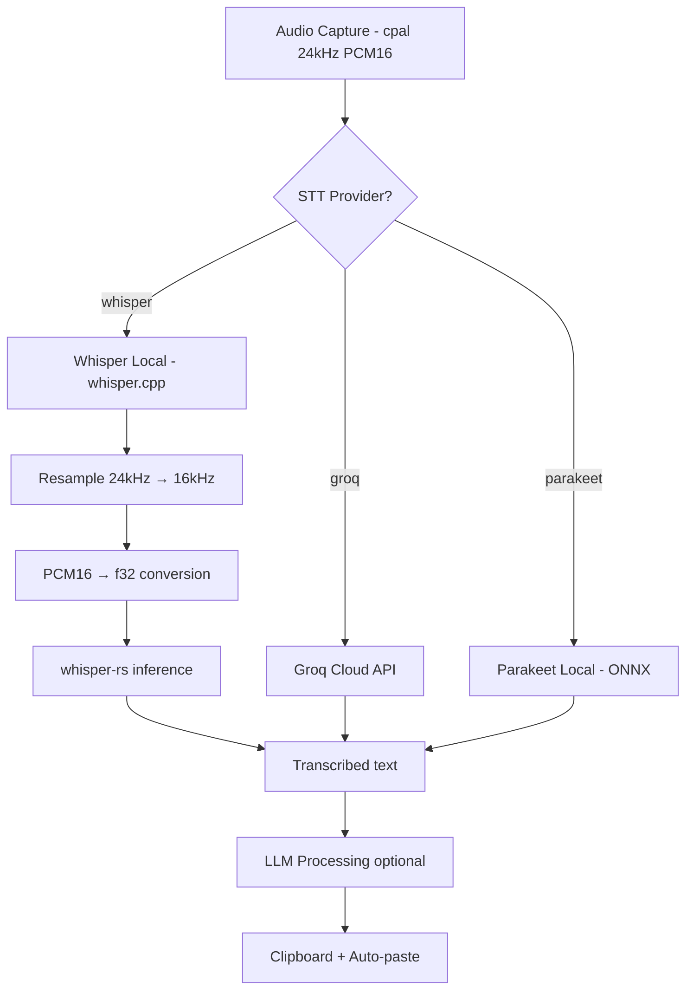

# Design: Local Whisper Transcription Provider

## Overview

Add a third STT provider — local Whisper — alongside Groq Cloud and NVIDIA Parakeet. Uses `whisper-rs` (Rust bindings to `whisper.cpp`) to run OpenAI's Whisper large-v3-turbo model on-device with Metal GPU acceleration on macOS.

This gives users Groq-quality transcription with zero cloud dependency, no API key, and full privacy.

### Why whisper-rs over ONNX?

Whisper is an encoder-decoder model with autoregressive token generation. Unlike Parakeet (CTC-based, single forward pass), Whisper requires managing a decode loop with KV-cache. whisper.cpp handles all of this internally. Using ONNX would mean writing ~300 lines of decoding logic ourselves for no benefit.

## Architecture



### Provider Selection

The existing `SttProvider` enum in `parakeet.rs` gets a third variant:

```rust
pub enum SttProvider {
    Groq,
    Parakeet,
    Whisper,  // new
}
```

Store key `STT_PROVIDER` accepts `"whisper"` as a new value.

## Components and Interfaces

### 1. New Rust Module: `src-tauri/src/whisper.rs`

Mirrors the pattern established by `parakeet.rs`:

```rust
// Core state (same pattern as ParakeetState)
pub struct WhisperState {
    model: Arc<Mutex<Option<WhisperContext>>>,
}

// Public API — matches Parakeet's interface
pub fn get_model_dir(app: &AppHandle) -> Result<PathBuf, String>;
pub fn is_model_downloaded(model_dir: &Path) -> bool;
pub async fn download_model(app: &AppHandle) -> Result<(), String>;
pub fn load_model(state: &WhisperState, model_dir: &Path) -> Result<(), String>;
pub fn unload_model(state: &WhisperState) -> Result<(), String>;
pub fn is_model_loaded(state: &WhisperState) -> bool;
pub fn transcribe_pcm16(state: &WhisperState, pcm16_24khz: Vec<u8>) -> Result<String, String>;
pub fn transcribe_file_local(state: &WhisperState, file_path: &Path) -> Result<String, String>;
pub fn delete_model(model_dir: &Path) -> Result<(), String>;
```

### 2. Model Details

| Property | Value |
|----------|-------|
| Model | `whisper-large-v3-turbo` |
| Format | GGML (ggerganov/whisper.cpp on HuggingFace) |
| File | `ggml-large-v3-turbo.bin` |
| Size | ~1.5 GB (f16) or ~850 MB (q5_0 quantized) |
| RAM | ~1.5-2.0 GB |
| Input | 16kHz mono f32 samples |
| GPU | Metal on macOS (via `whisper-rs` `metal` feature) |

Recommended: ship with **q5_0 quantized** model (~850 MB download, ~1 GB RAM) for the best size/quality tradeoff. Quality loss from q5_0 is negligible for speech transcription.

### 3. Cargo Dependency

```toml
[dependencies]
whisper-rs = { version = "0.13", features = ["metal"] }

[target.'cfg(target_os = "linux")'.dependencies]
whisper-rs = { version = "0.13", features = ["cuda"] }
```

The `metal` feature enables GPU acceleration on macOS. On Linux/Windows, `cuda` can be used if an NVIDIA GPU is present, otherwise it falls back to CPU.

### 4. Audio Pipeline

Reuses existing infrastructure from `parakeet.rs`:

1. Receive `Vec<u8>` of PCM16 little-endian at 24kHz (same as Parakeet path)
2. Convert to `Vec<f32>` by dividing by 32768.0
3. Resample 24kHz → 16kHz using existing `resample_audio()` function (extract to shared `audio_utils` or keep in each module)
4. Pass `&[f32]` to `whisper_rs::WhisperContext::full()`
5. Extract text segments from result

### 5. Frontend Changes

#### Settings UI (`GeneralSection.tsx`)

Add "Whisper (Local)" option to the STT provider dropdown, alongside existing "Groq Cloud" and "Parakeet (Local)" options.

The Whisper option should show:
- Model download button (reuse same pattern as Parakeet)
- Download progress bar
- Model size info (~850 MB for q5_0)
- Delete model button

#### Store Keys (`storeKeys.ts`)

No new keys needed — reuse `STT_PROVIDER` with value `"whisper"`.

Add events:
- `whisper-download-progress` — download progress updates
- `whisper-loading` — model loading state

### 6. Tauri Commands (`lib.rs`)

New commands mirroring Parakeet's:

```rust
#[tauri::command]
async fn download_whisper_model(app: AppHandle) -> Result<(), String>;

#[tauri::command]
fn is_whisper_model_downloaded(app: AppHandle) -> Result<bool, String>;

#[tauri::command]
fn delete_whisper_model(app: AppHandle, state: State<'_, WhisperState>) -> Result<(), String>;

#[tauri::command]
fn load_whisper_model(app: AppHandle, state: State<'_, WhisperState>) -> Result<(), String>;
```

The existing `stop_recording` flow in `lib.rs` needs a third branch for `SttProvider::Whisper` that calls `whisper::transcribe_pcm16()`.

## Data Models

### Model Storage

```
{app_data_dir}/
├── models/
│   ├── parakeet-tdt-v3/          # existing
│   │   ├── encoder-model.onnx
│   │   ├── decoder_joint-model.onnx
│   │   └── vocab.txt
│   └── whisper-large-v3-turbo/   # new
│       └── ggml-large-v3-turbo-q5_0.bin
```

Single file download (~850 MB) vs Parakeet's 3-file approach. Simpler.

### Download Source

HuggingFace: `https://huggingface.co/ggerganov/whisper.cpp/resolve/main/ggml-large-v3-turbo-q5_0.bin`

## Error Handling

Follow the same patterns as Parakeet:

- **Download interruption**: Atomic writes via temp file + rename. Leftover `.tmp` files cleaned on next download attempt.
- **Model load failure**: Return descriptive error string, UI shows "Download model" prompt.
- **Transcription failure**: Return `Err(String)` to Tauri command, frontend shows error toast.
- **Concurrent access**: `Arc<Mutex<Option<WhisperContext>>>` with poison recovery (same as `ParakeetState`).
- **Delete during transcription**: Check `IS_TRANSCRIBING` flag before allowing deletion (shared with Parakeet's existing guard).

## Testing Strategy

### Unit Tests
- Audio format conversion: PCM16 → f32 at correct scale
- Resampling: verify 24kHz → 16kHz output length and quality
- `SttProvider::from_store_value("whisper")` returns correct variant

### Integration Tests
- Model download: verify file exists and is non-empty after download
- Model load/unload cycle: no crashes, state is correct
- Transcription: short audio clip produces non-empty text

### Manual Testing
- End-to-end: record via global shortcut → local Whisper transcription → clipboard
- Provider switching: swap between Groq/Parakeet/Whisper mid-session
- Model management: download, delete, re-download
- Memory usage: monitor during transcription (should stay under ~2 GB)
- Metal acceleration: confirm GPU usage via Activity Monitor on macOS

## Implementation Plan

### Phase 1: Core Backend
1. Add `whisper-rs` dependency to `Cargo.toml` with `metal` feature
2. Create `src-tauri/src/whisper.rs` module (model management + transcription)
3. Extract shared `SttProvider` enum to its own location or keep in `parakeet.rs`
4. Add `WhisperState` to Tauri managed state in `lib.rs`
5. Add Tauri commands for download/load/delete/transcription
6. Wire `SttProvider::Whisper` into the recording stop flow

### Phase 2: Frontend
7. Add "Whisper (Local)" to provider dropdown in `GeneralSection.tsx`
8. Add download/delete UI for Whisper model (reuse Parakeet's pattern)
9. Listen for `whisper-download-progress` and `whisper-loading` events

### Phase 3: Polish
10. Test on macOS with Metal acceleration
11. Verify model download/load/transcribe cycle
12. Update any file transcription paths to support Whisper provider

## Design Decisions

| Decision | Choice | Rationale |
|----------|--------|-----------|
| Library | `whisper-rs` over ONNX | whisper.cpp handles autoregressive decoding, beam search, VAD internally. ONNX would require reimplementing all of this. |
| Model | `large-v3-turbo` q5_0 | 2-3x faster than large-v3, half the size, negligible quality difference. q5_0 quantization cuts download to ~850 MB with no perceptible accuracy loss. |
| GPU | Metal feature flag | macOS is the primary target. Metal gives 5-10x speedup over CPU on Apple Silicon. |
| Architecture | Mirror Parakeet pattern | Consistent codebase. Same state management, same command structure, same UI patterns. Minimal new concepts to introduce. |
| Single file | GGML format | Unlike Parakeet's 3-file ONNX setup, whisper.cpp uses a single GGML file. Simpler download logic. |
