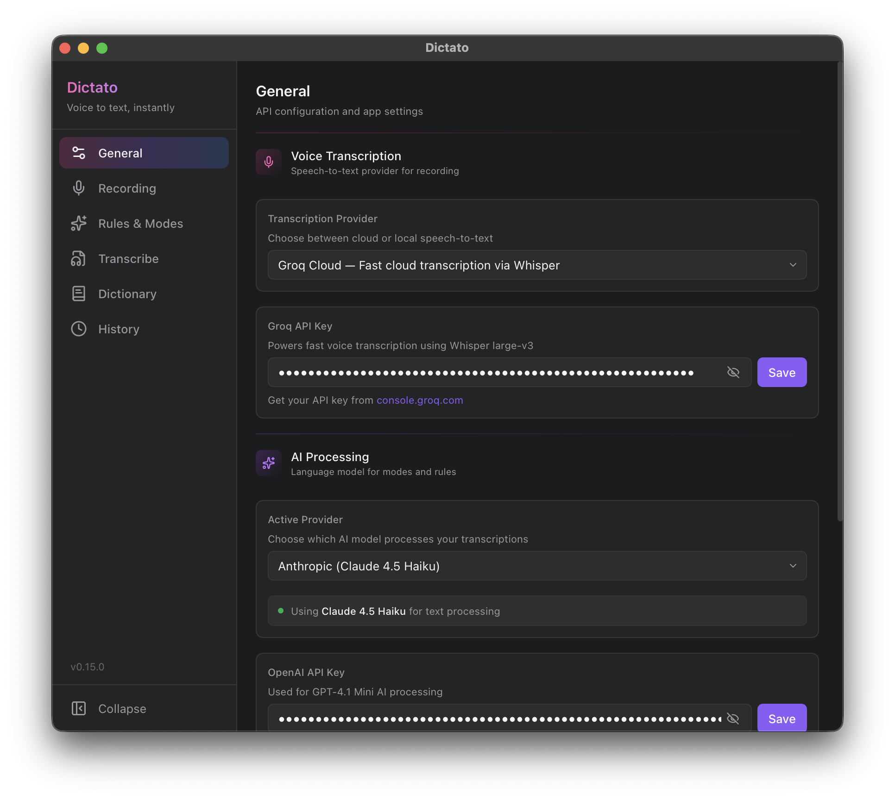
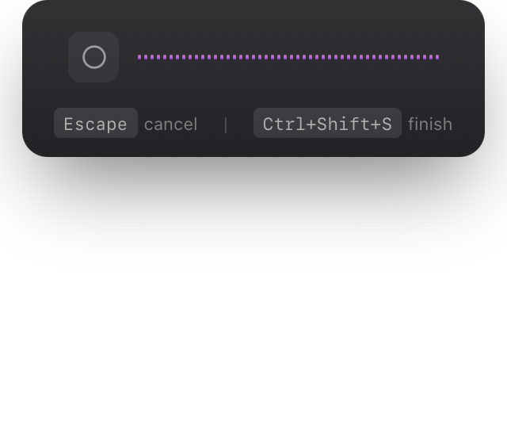
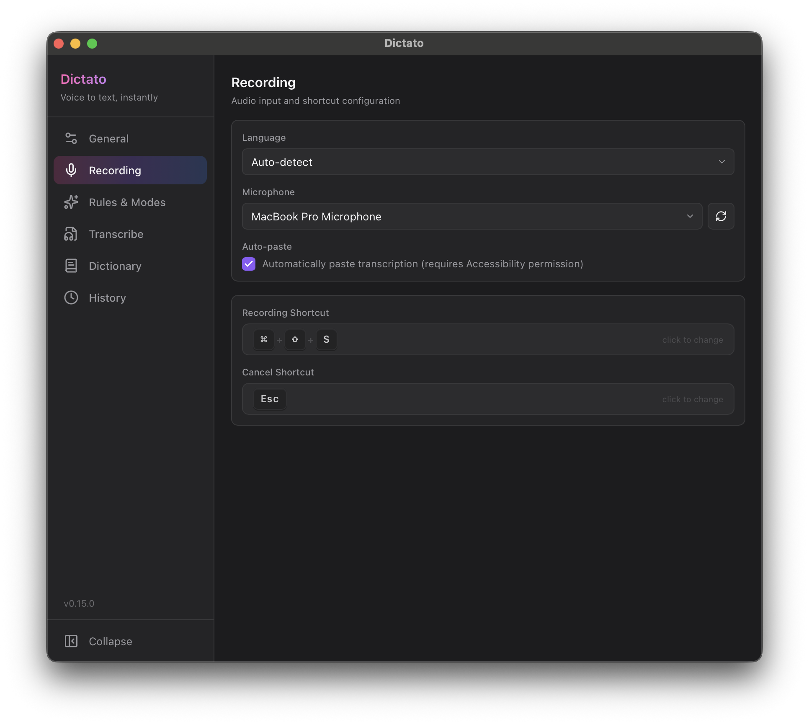
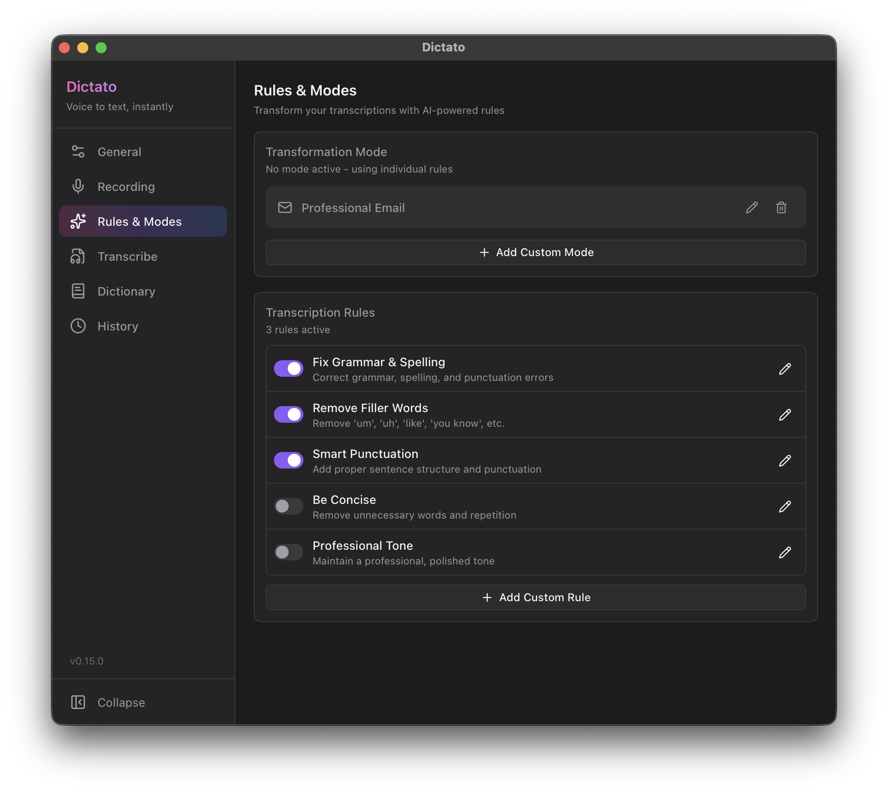
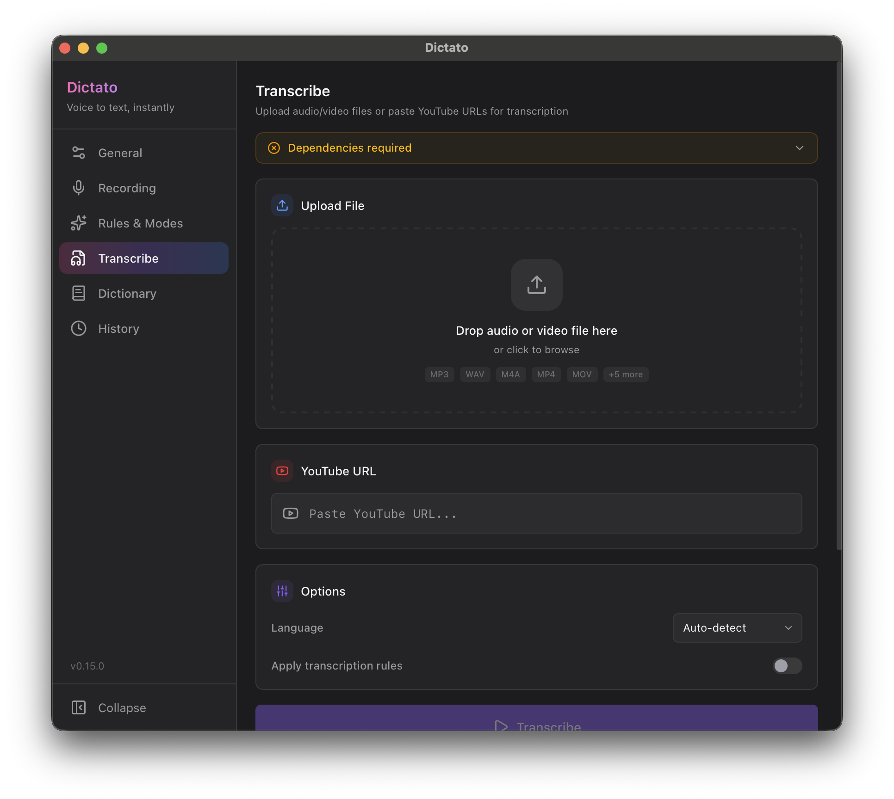

# Dictato

Voice-to-text transcription app with AI-powered text transformation.

<p align="center">
  
</p>
<p align="center">
  
</p>
<p align="center">
  
</p>
<p align="center">
  
</p>
<p align="center">
  
</p>

## Development

### Commands

```bash
# Dev (frontend + Tauri)
bun run tauri dev

# Build release
bun run tauri build

# Frontend only
bun run dev       # Vite dev server on :1420
bun run build     # TypeScript + Vite build
```

### Release

```bash
git tag -a v0.3.0 -m "Release message"
git push origin --tags
```
