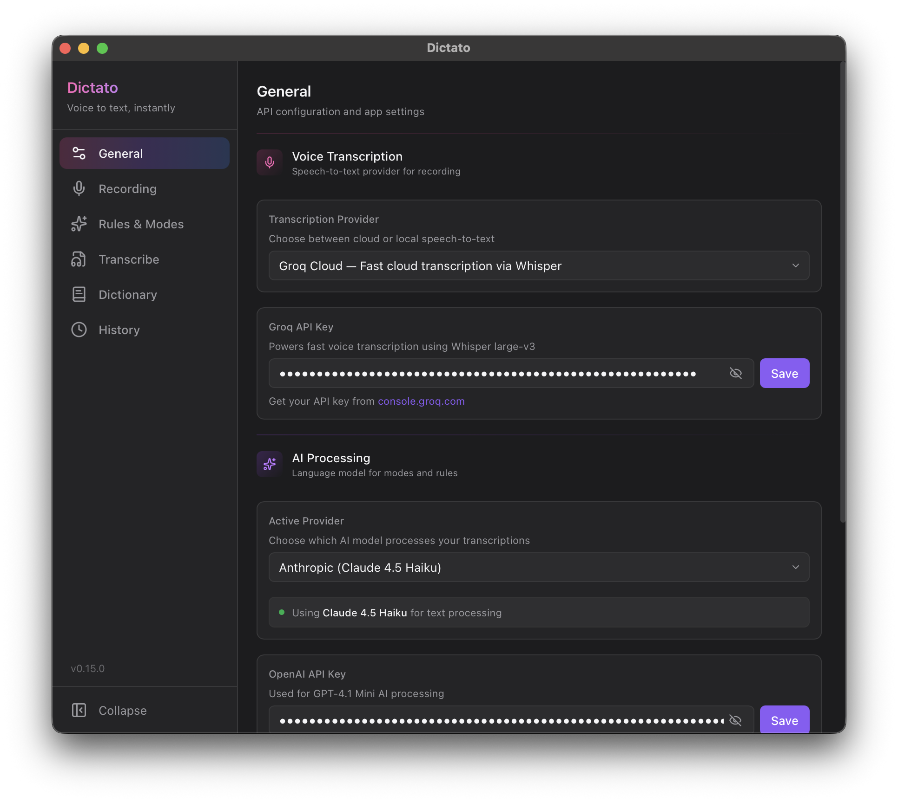
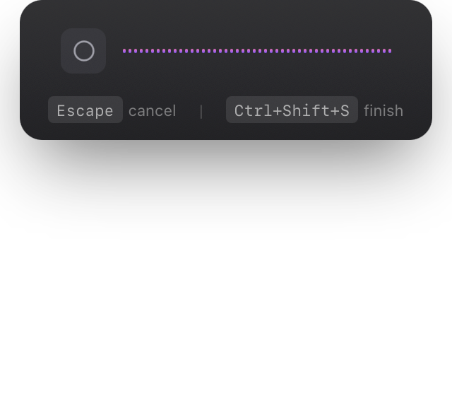
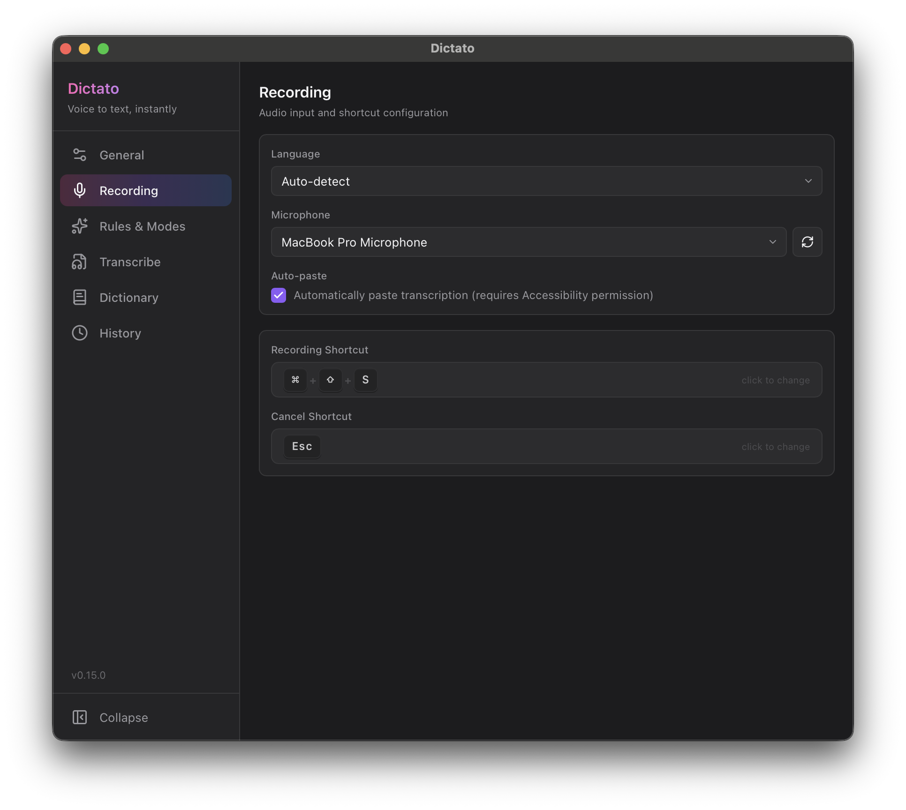
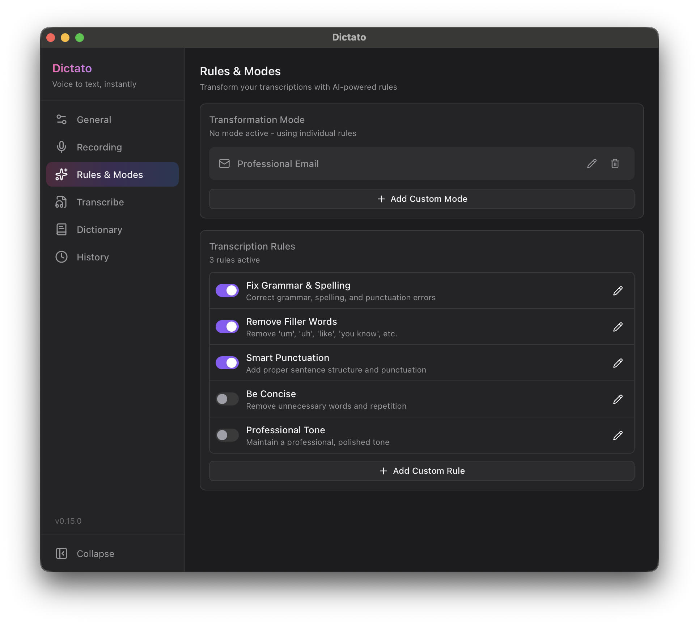
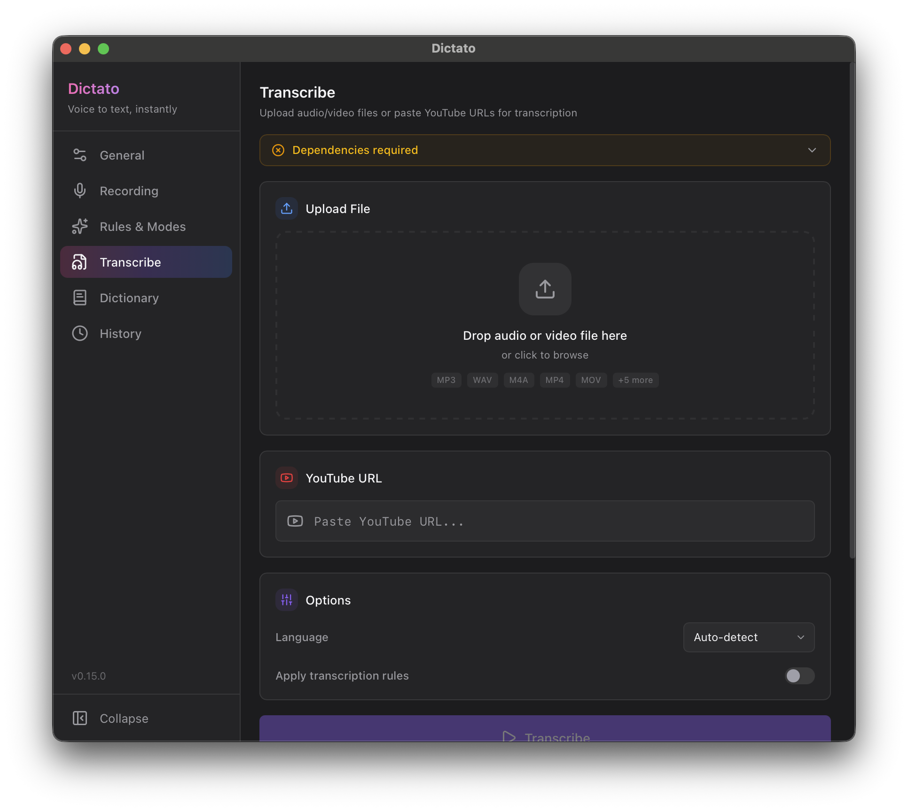

# Dictato

A desktop voice-to-text app: press a global shortcut, speak, and the transcribed text is pasted straight into whatever app you're working in — optionally rewritten by an LLM along the way (e.g. "make it a polite email" or "format as a bullet list").

<p align="center">
  
</p>
<p align="center">
  
</p>
<p align="center">
  
</p>
<p align="center">
  
</p>
<p align="center">
  
</p>

## Features

- **Push-to-talk dictation** — trigger recording anywhere with a configurable global shortcut; a small always-on-top orb shows recording state, and the result is auto-pasted into the active app
- **Three transcription engines**, switchable in settings:
  - **Groq** — cloud Whisper API (fast, needs an API key)
  - **Parakeet** — NVIDIA Parakeet TDT v3 running fully locally (~670 MB download, 25 languages)
  - **Whisper** — OpenAI Whisper large-v3-turbo via whisper.cpp, Metal-accelerated on Apple Silicon (~850 MB download)
- **Rules & Modes** — define reusable text-transformation rules (tone, formatting, translation…) applied to transcripts by an LLM; supports OpenAI, Google Gemini, and Anthropic Claude with per-provider model selection
- **Dictionary** — custom vocabulary to steer tricky names and jargon
- **File & YouTube transcription** — drop in an audio file or paste a YouTube link (uses `yt-dlp` + `ffmpeg`)
- **History & stats** — browse past transcriptions and usage statistics
- **Pure Paste** — global shortcut that pastes the clipboard as plain text, stripping formatting
- **Cleaning Mode** — locks the keyboard and trackpad so you can wipe them without typing gibberish (macOS)
- Auto-updates, launch-at-login, and a tray icon

API keys are entered in the app's settings and stored locally — no config files to edit.

## Tech stack

Tauri v2 · Rust (tokio, cpal, whisper-rs, parakeet-rs, enigo) · React 19 · TypeScript · Tailwind CSS v4 · shadcn/ui · Vite · Bun

## Install

Download the latest release for macOS, Windows, or Linux from the [Releases page](https://github.com/pmichalski98/dictato/releases). Built and primarily tested on macOS (Apple Silicon).

## Development

Prerequisites: [Bun](https://bun.sh), the [Rust toolchain](https://rustup.rs), and the [Tauri v2 system dependencies](https://v2.tauri.app/start/prerequisites/) for your platform.

```bash
bun install

# Run the app in dev mode (frontend + Tauri)
bun run tauri dev

# Build a release bundle
bun run tauri build
```

The frontend alone can be run with `bun run dev` (Vite on port 1420).
